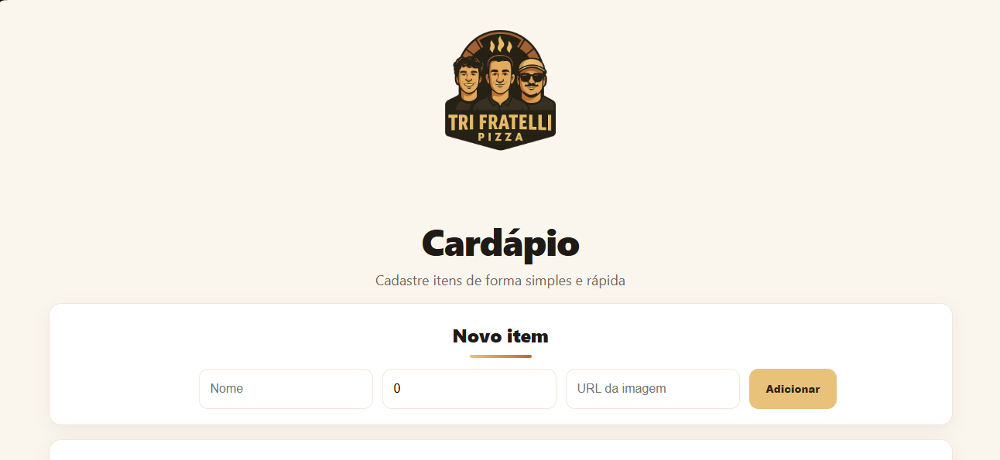
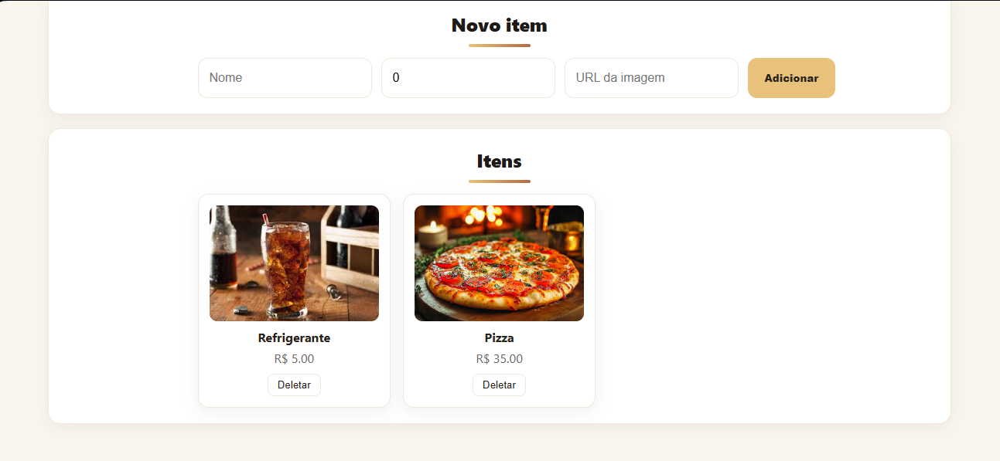

# 🍕 Tri Fratelli Frontend

[](https://skillicons.dev)

---

## 🍽️ Sobre o Projeto

O Frontend é a interface visual do cardápio digital da pizzaria Tri Fratelli, permitindo que os clientes visualizem os produtos, seus preços e imagens de forma simples e moderna.

O projeto foi desenvolvido em React com TypeScript, utilizando CSS puro para estilização e comunicação direta com a API REST do backend.

Todos ajustes visuais e de integração foram realizados por João Pedro, garantindo uma experiência fluida e responsiva.

---

## ⚙️ Tecnologias Utilizadas

- React  
- TypeScript  
- CSS3  
- Vite  
- Axios  

---

## 🧩 Estrutura do Projeto
```
frontend/
├── public/
│ └── index.html
├── src/
│ ├── api/
│ │ └── foodApi.ts
│ ├── components/
│ │ ├── FoodCard.tsx
│ │ └── FoodForm.tsx
│ │ └── FoodCard.css
│ │ └── FoodForm.css
│ ├── types/
│ │ └── Food.ts
│ ├── App.tsx
│ ├── index.tsx
│ ├── App.css
│ └── inde.css
├── package.json
├── tsconfig.json
└── readmeFrontend.md
```

---

## 🚀 Como Rodar o Projeto

### 🧱 Pré-requisitos

- Node.js (versão 18 ou superior)  
- npm ou yarn  
- Backend rodando (porta 5000 por padrão)

### 🖥️ Clonando o repositório

```
git clone https://github.com/joaopedrogr/Cardapio-Digital.git
cd frontend
npm install
```

### ⚙️ Configurando o ambiente

Crie um arquivo .env na raiz do projeto: `VITE_API_URL=http://localhost:5000`

### 🔧 Rodando o projeto localmente
```
npm run dev
```

O front-end estará disponível em: `http://localhost:3000`

---

## 📡 Comunicação com o Backend

O front consome diretamente a API do backend nos seguintes endpoints:
```
| Método | Rota          | Descrição                              |
|--------|---------------|----------------------------------------|
| GET    | /api/foods    | Retorna todos os alimentos cadastrados |
| POST   | /api/foods    | Cadastra um novo alimento              |
| DELETE | /api/foods/:id| Remove um alimento pelo ID             |
```

---

## 🧾 Funcionalidades

- Exibição dinâmica dos alimentos cadastrados
- Adição de novos itens via formulário
- Exclusão de produtos em tempo real
- Atualização automática da lista de itens

---

## 🎨 Layout

A interface foi construída com CSS puro, mantendo uma identidade visual simples e elegante, com cores e estilos inspirados na pizzaria Tri Fratelli.




## 📄 Licença

Este projeto é de uso livre para fins de estudo e demonstração de integração entre front-end e back-end com Node.js, React e TypeScript. Sinta-se à vontade para adaptar, contribuir ou expandir conforme desejar.

